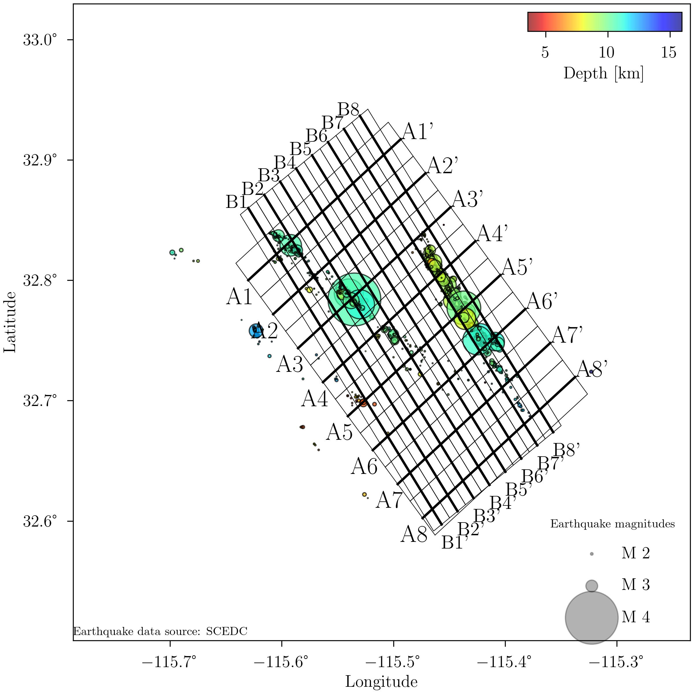
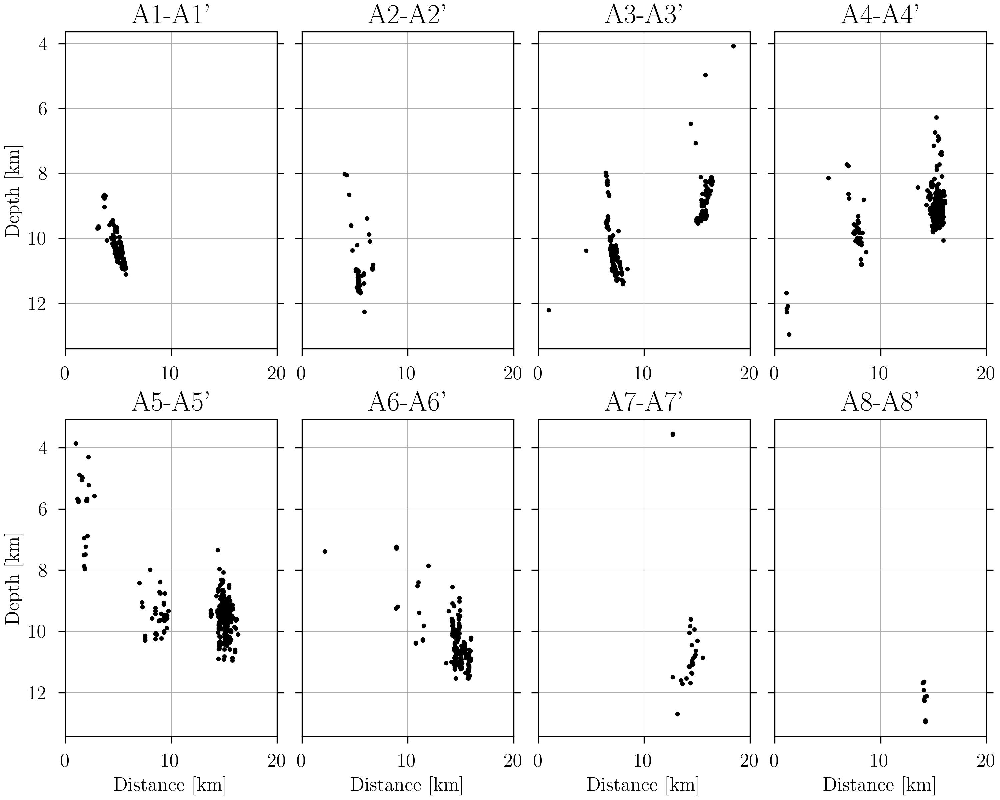
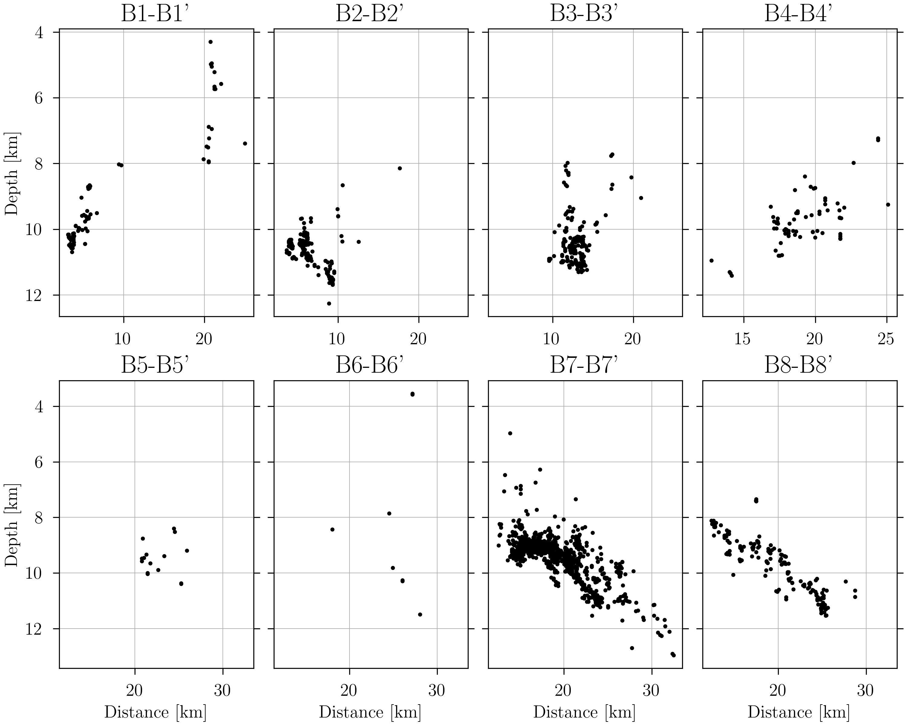

# Cross-section generation with Python

This repository provides a Python code for generating cross-section plots in seismology research. The method offers an easy and efficient way to create cross-sections, allowing you to to analyze hypocenter distribution.

## Overview

## Features

- **Easy cross-section generation:** Learn a step-by-step approach to project hypocenters onto section lines, obtain projected coordinates, and write projection data.
- **Contiguous cross-sections**: Generate a set of n contiguous cross-sections with a desired width.
- **Flexible visualization options**
- **Alternative to Pygmt**: This repository provides an alternative solution for cross-section generation without relying on the Pygmt library.

## Getting started

Follow the instructions below to get started with using cross-section generation:

1. **Installation**: Install the required Python libraries by running '*pip install -r requirements.txt'.
2. **Data preparation**: Prepare your event catalog in the required format.

## Dependencies

The following Python libraries are used in this project:

- NumPy
- Shapely
- Matplotlib
- Obspy

## Colab

Open the Jupyter Notebook in Google Colab:

## Contributing

Contributions to this repository are welcome! If you have any suggestions/improvements/bug fixes, please feel free to submit a pull request.

## License

This project is licensed under the **MIT License**.

## Contact

Emmanuel Guzman Vitola
emguzmanvi@unal.edu.co